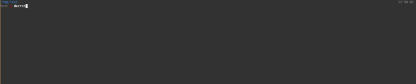
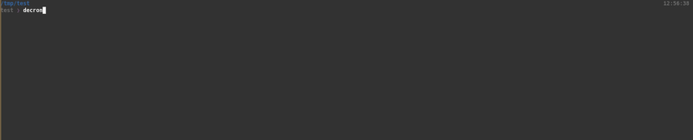

<!-- PROJECT SHIELDS -->
[![Forks][forks-shield]][forks-url]
[![Stargazers][stars-shield]][stars-url]
[![Issues][issues-shield]][issues-url]
[![MIT License][license-shield]][license-url]
[![LinkedIn][linkedin-shield]][linkedin-url]


<!-- PROJECT LOGO -->
<br />
<p align="center">
  <!-- TODO: Get a logo
   <a href="">
    
  </a> -->

  <h3 align="center">Decronym</h3>

  <p align="center">
    Because TLAs can be such a PITA!
  </p>
</p>


<!-- TABLE OF CONTENTS -->
<details open="open">
  <summary>Table of Contents</summary>
  <ol>
    <li>
      <a href="#about-the-project">About The Project</a>
    </li>
    <li>
      <a href="#getting-started">Getting Started</a>
      <ul>
        <li><a href="#prerequisites">Prerequisites</a></li>
        <li><a href="#installation">Installation</a></li>
      </ul>
    </li>
    <li><a href="#usage">Usage</a></li>
    <li><a href="#contributing">Contributing</a></li>
    <li><a href="#license">License</a></li>
    <li><a href="#contact">Contact</a></li>
    <li><a href="#acknowledgements">Acknowledgements</a></li>
  </ol>
</details>


<!-- ABOUT THE PROJECT -->
## About
**Decronym** aims to make acronym lookup less bad. 


<!-- GETTING STARTED -->
## Getting Started
### Prerequisites

This is an example of how to list things you need to use the software and how to install them.
* python
  ```sh
    sudo apt-get install python3 python3-venv
  ```

### Installation
**WARNING**: Decronym is currently in alpha and only available from https://test.pypi.org/, once released this README fill be updated

* If you are using venv:
```sh
python3 -m venv venv && source venv/bin/activate
```

* pip install:
```sh
pip install --index-url https://test.pypi.org/simple/ -U --extra-index-url https://pypi.org/simple decronym
```


<!-- USAGE EXAMPLES -->
## Usage
```
❯ decronym
Usage: decronym [OPTIONS] COMMAND [ARGS]...

  Decronym CLI

Options:
  --config PATH  Path to the config file to use.
  --help         Show this message and exit.

Commands:
  clean   Deletes all local cache files.
  config  Configuration helper.
  find    Searches for acronyms.
  update  Updates locally cached definition files based on config.
```

* Find acronyms:


* Clean and update cache files:


* By default Decronym will search the user `.config` path and default package path for config in that order. You can dump the config to a file or edit it directly:


* To add sources you can edit the config or use `config --add`:


* To remove sources either delete them from config or use `config --remove`:
 

<!-- ROADMAP -->
## Roadmap
See the [open issues](https://github.com/lokraszewski/decronym/issues) for a list of proposed features (and known issues).


<!-- CONTRIBUTING -->
## Contributing
Any contributions you make are **greatly appreciated**.

1. Fork the Project
2. Create your Feature Branch (`git checkout -b feature/AmazingFeature`)
3. Commit your Changes (`git commit -m 'Add some AmazingFeature'`)
4. Push to the Branch (`git push origin feature/AmazingFeature`)
5. Open a Pull Request


<!-- LICENSE -->
## License
Distributed under the MIT License. See `LICENSE` for more information.


<!-- CONTACT -->
## Contact
Lukasz Okraszewski  - lokraszewski.work@gmail.com

Project Link: [https://github.com/lokraszewski/decronym](https://github.com/lokraszewski/decronym)


<!-- ACKNOWLEDGEMENTS -->
## Acknowledgements
### Current Third-Party Sources:
* [acronyms.silmaril.ie](acronyms.silmaril.ie)


<!-- MARKDOWN LINKS & IMAGES -->
<!-- https://www.markdownguide.org/basic-syntax/#reference-style-links -->
[forks-shield]: https://img.shields.io/github/forks/lokraszewski/decronym.svg?style=for-the-badge
[forks-url]: https://github.com/lokraszewski/decronym/network/members
[stars-shield]: https://img.shields.io/github/stars/lokraszewski/decronym.svg?style=for-the-badge
[stars-url]: https://github.com/lokraszewski/decronym/stargazers
[issues-shield]: https://img.shields.io/github/issues/lokraszewski/decronym.svg?style=for-the-badge
[issues-url]: https://github.com/lokraszewski/decronym/issues
[license-shield]: https://img.shields.io/github/license/lokraszewski/decronym.svg?style=for-the-badge
[license-url]: https://github.com/lokraszewski/decronym/blob/main/LICENSE
[linkedin-shield]: https://img.shields.io/badge/-LinkedIn-black.svg?style=for-the-badge&logo=linkedin&colorB=555
[linkedin-url]: https://www.linkedin.com/in/lukasz-okraszewski-5511b4a6/?originalSubdomain=uk
[product-screenshot]: images/screenshot.png